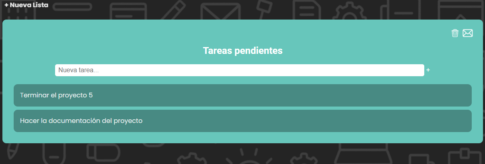

# Dootzy

## Dootzy es un proyecto que hemos creado para organizar nuestro día a día.

Nuestro proyecto consta de tres apartados diferentes, Tablero, Compra y Calendario. Vamos a desglosar cada uno de ellos para poder usarlos adecuadamente.

En primer lugar y antes de nada la aplicación nos va a pedir que permitamos la geolocalización, debemos aceptarlo, más adelante explicaremos porqué.

También nos da la opción de instalarlo como una aplicación, cosa que facilita su uso para el día a día. 

Es muy sencillo, nos aparece un botón de instalar aplicación con fondo naranja en la parte superior de la página, sólo tenemos que darle y se instalará la aplicación.

En la parte superior de la página siempre estará nuestro navbar, donde podremos ir a los diferentes apartados de nuestra página:

1- Tablero, nos lleva al apartado principal donde podemos crear listas y añadirles tareas.

2- Compra, tenemos aquí un apartado con una lista de la compra, para que no interfiera en el apartado de nuestras tareas más profesionales.

3- Calendario, en este apartado tenemos un calendario para poder poner nuestros eventos y pedirle que nos avise con la antelación que nos parezca oportuna.

4- Icono de Dootzy, para alternar entre el tema oscuro y tema claro.

### 1- Tablero

Como hemos dicho anteriormente aquí vamos a crear todas las listas que queramos de manera fácil y ordenada para organizar nuestro día a día y ser más eficientes.

En este apartado tenemos:

1- Calendario en miniatura, para poder ver en que día estamos y también nos aparece marcado el día si le hemos añadido algún evento al apartado de calendario.

2- Un apartado que conecta a una API del tiempo, en la que nos sale en que zona estamos, que temperatura hace, la humedad y el viento.

3- Botón para añadir nuevas listas.

En este apartado cuando le damos al boton + Nueva Lista, nos aparece un modal para que creemos la lista como más nos guste.

En este modal podemos poner el nombre que queramos darle a la lista, da igual si la primer letra no la ponemos en mayúscula, al pulsar sobre crear se pondrá mayúscula automáticamente. Ahora cuando ya tenemos el nombre podemos seleccionar el color que más nos guste y luego le damos a crear.

Ahora ya tenemos la lista creada, desde el botón del símbolo + que aparece en la izquierda del apartado Nueva tarea… podemos añadir la tarea en cuestión.

Podemos añadir todas las tareas que queramos. Siguen el mismo patrón que las listas, la primer letra será mayúscula siempre.

Ahora podemos seguir añadiendo tareas, o crear nuevas listas como ya sabemos.

A continuación, podemos usar los botones de la parte superior derecha.

El icono de la basura borrará la lista.

El icono del sobre nos despliega un modal para mandar la lista por correo a la dirección que pongamos.

Por último nos faltan dos funciones:

Arrastrar tareas, si pulsamos y mantenemos pulsado encima de una tarea podemos arrastrarla y cambiar el orden de las tareas o llevarla a otra lista.

Borrar tarea, si hacemos un clic rápido sobre una tarea, nos preguntará si queremos borrarla.

### 2- Compra

En este apartado tenemos una lista de la compra en la que podemos añadir elementos que nos hace falta comprar, es un apartado especial para esto, asi no interfiere en las demás listas.

### 3- Calendario

En este apartado podemos agregar eventos para tenerlos controlados por hora e incluso podemos pedirle que nos avise cuando sea el momento, o incluso con antelación. Ahora veremos como funciona esto.

Lo primero, los botones de la izquierda, que nos cambian de semana, uno a la izquierda, otro a la derecha y el botón de hoy que nos lleva al día en el que estamos hoy.

En la parte de la derecha tenemos tres diferentes vistas de la página, tenemos la vista mes, la semana y la día.

Para agregar cualquier evento al calendario tenemos dos opciones:

1- Click rapido, nos abre un modal para añadir la tarea en ese mismo lugar.

2- Click mantener y arrastrar, para que la tarea pueda ser de varios cuadraditos.

El modal en ambos casos es el mismo y es así:

En el podemos poner el evento que queramos, podemos poner la hora de inicio del evento, la hora de fin, y los minutos de antelación que quiero que me avise la página.

Le damos a crear y ya lo tendríamos listo.

Este proyecto ha sido realizado por Yria Forján Oliveira y Carlos Vidal Puigcerver, esperando que sea de utilidad.